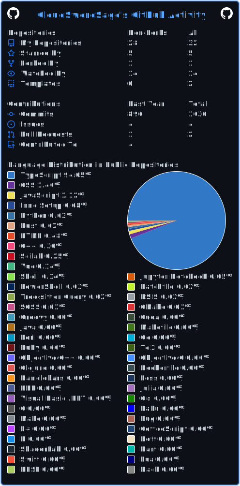

# 🌊 你好！我是墨烟行 | Hi there! I'm CloudSwordSage 🗡️

⚡ **A passionate developer exploring the realms of code**  
🌌 *Turning coffee into code, one commit at a time*

⚡ **执代码为剑，探数字疆界的开发者**  
🌌 *以咖啡为墨，写字节人生，每次提交皆是修行*

---

## 🛠️ 技术栈 | Tech Arsenal

<div align="center" style="margin: 20px 0;">
  
</div>

---

## 📚 当前修炼 | Learning Trail

<div align="center" style="margin: 20px 0;">
  
  
  
  
</div>

---

## 📮 联系通道 | Connect With Me

<div align="center">
  
[](mailto:cloudswordsage@qq.com)
[](mailto:zlf100518@163.com)
[](mailto:zlf100518@gmail.com)

</div>

---

## 📊 数据统计 | Analytics

<div align="center">

### 🌌 访问轨迹 | Footprints

[](https://github.com/CloudSwordSage)

[](https://github.com/cicirello/user-statistician)

### ⚡ 代码活力 | Activity

[](https://github.com/CloudSwordSage)

</div>

---

## ⏳ 编程报告 | WakaTime

<!--START_SECTION:waka-->


**🐱 我的 GitHub 数据** 

> 📦  使用了 2.0 MB GitHub 存储空间 
 > 
> 🏆 292 个贡献，在 2026 年
 > 
> 💼 开放招聘
 > 
> 📜 28 个公共仓库 
 > 
> 🔑 0 个私人仓库 
 > 
**我是夜猫 🦉** 

```text
🌞 早晨                     93 commits          ███░░░░░░░░░░░░░░░░░░░░░░   11.65 % 
🌆 白天                     290 commits         █████████░░░░░░░░░░░░░░░░   36.34 % 
🌃 傍晚                     225 commits         ███████░░░░░░░░░░░░░░░░░░   28.20 % 
🌙 晚上                     190 commits         ██████░░░░░░░░░░░░░░░░░░░   23.81 % 
```
📅 **星期六 时的我最有干劲** 

```text
星期一                      94 commits          ███░░░░░░░░░░░░░░░░░░░░░░   11.78 % 
星期二                      124 commits         ████░░░░░░░░░░░░░░░░░░░░░   15.54 % 
星期三                      121 commits         ████░░░░░░░░░░░░░░░░░░░░░   15.16 % 
星期四                      107 commits         ███░░░░░░░░░░░░░░░░░░░░░░   13.41 % 
星期五                      116 commits         ████░░░░░░░░░░░░░░░░░░░░░   14.54 % 
星期六                      131 commits         ████░░░░░░░░░░░░░░░░░░░░░   16.42 % 
星期日                      105 commits         ███░░░░░░░░░░░░░░░░░░░░░░   13.16 % 
```


📊 **本周消耗时间** 

```text
🕑︎ 时区: Asia/Shanghai

💬 编程语言: 
Python                   9 hrs 15 mins       █████████░░░░░░░░░░░░░░░░   35.17 % 
Markdown                 5 hrs 7 mins        █████░░░░░░░░░░░░░░░░░░░░   19.47 % 
C++                      3 hrs 55 mins       ████░░░░░░░░░░░░░░░░░░░░░   14.92 % 
TSV                      2 hrs 55 mins       ███░░░░░░░░░░░░░░░░░░░░░░   11.12 % 
Other                    1 hr 16 mins        █░░░░░░░░░░░░░░░░░░░░░░░░   04.82 % 

🔥 编辑器: 
Trae                     26 hrs 14 mins      █████████████████████████   99.62 % 
VS Code                  6 mins              ░░░░░░░░░░░░░░░░░░░░░░░░░   00.38 % 

🐱‍💻 项目: 
TexSolve                 14 hrs 50 mins      ██████████████░░░░░░░░░░░   56.35 % 
english_ocr              10 hrs 22 mins      ██████████░░░░░░░░░░░░░░░   39.39 % 
css_test                 45 mins             █░░░░░░░░░░░░░░░░░░░░░░░░   02.86 % 
DownLoad                 15 mins             ░░░░░░░░░░░░░░░░░░░░░░░░░   01.00 % 
Unknown Project          6 mins              ░░░░░░░░░░░░░░░░░░░░░░░░░   00.38 % 

💻 操作系统: 
Windows                  26 hrs 20 mins      █████████████████████████   100.00 % 
```

**我最常使用 Python** 

```text
Python                   12 repos            █████████████░░░░░░░░░░░░   52.17 % 
TypeScript               4 repos             ████░░░░░░░░░░░░░░░░░░░░░   17.39 % 
Vue                      2 repos             ██░░░░░░░░░░░░░░░░░░░░░░░   08.70 % 
C++                      1 repo              █░░░░░░░░░░░░░░░░░░░░░░░░   04.35 % 
JavaScript               1 repo              █░░░░░░░░░░░░░░░░░░░░░░░░   04.35 % 
```


**时间线**


 Last Updated on 03/02/2026 13:50:01 UTC
<!--END_SECTION:waka-->

---

<div align="center">
  
</div>

✨ *"The best way to predict the future is to code it."* ✨  
✨ *"预知未来最好的方式，就是亲手编码它"* ✨
