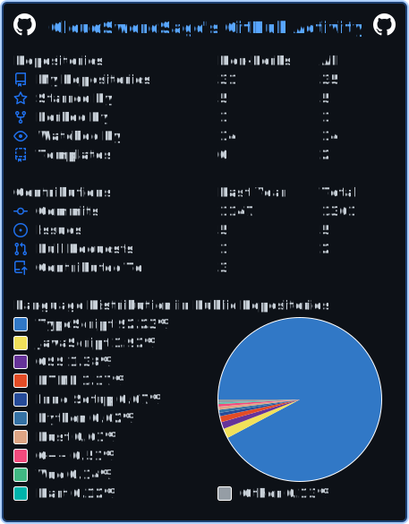

# 🌊 你好！我是墨烟行 | Hi there! I'm CloudSwordSage 🗡️

⚡ **A passionate developer exploring the realms of code**  
🌌 *Turning coffee into code, one commit at a time*

⚡ **执代码为剑，探数字疆界的开发者**  
🌌 *以咖啡为墨，写字节人生，每次提交皆是修行*

---

## 🛠️ 技术栈 | Tech Arsenal

<div align="center" style="margin: 20px 0;">
  
</div>

---

## 📚 当前修炼 | Learning Trail

<div align="center" style="margin: 20px 0;">
  
  
  
  
</div>

---

## 📮 联系通道 | Connect With Me

<div align="center">
  
[](mailto:cloudswordsage@qq.com)
[](mailto:zlf100518@163.com)
[](mailto:zlf100518@gmail.com)

</div>

---

## 📊 数据统计 | Analytics

<div align="center">

### 🌌 访问轨迹 | Footprints

[](https://github.com/CloudSwordSage)

[](https://github.com/cicirello/user-statistician)

### ⚡ 代码活力 | Activity

[](https://github.com/CloudSwordSage)

</div>

---

## ⏳ 编程报告 | WakaTime

<!--START_SECTION:waka-->


**🐱 我的 GitHub 数据** 

> 📦  使用了 2.0 MB GitHub 存储空间 
 > 
> 🏆 710 个贡献，在 2026 年
 > 
> 💼 开放招聘
 > 
> 📜 34 个公共仓库 
 > 
> 🔑 0 个私人仓库 
 > 
**我是夜猫 🦉** 

```text
🌞 早晨                     164 commits         ███░░░░░░░░░░░░░░░░░░░░░░   13.26 % 
🌆 白天                     397 commits         ████████░░░░░░░░░░░░░░░░░   32.09 % 
🌃 傍晚                     355 commits         ███████░░░░░░░░░░░░░░░░░░   28.70 % 
🌙 晚上                     321 commits         ██████░░░░░░░░░░░░░░░░░░░   25.95 % 
```
📅 **星期六 时的我最有干劲** 

```text
星期一                      158 commits         ███░░░░░░░░░░░░░░░░░░░░░░   12.77 % 
星期二                      192 commits         ████░░░░░░░░░░░░░░░░░░░░░   15.52 % 
星期三                      173 commits         ███░░░░░░░░░░░░░░░░░░░░░░   13.99 % 
星期四                      156 commits         ███░░░░░░░░░░░░░░░░░░░░░░   12.61 % 
星期五                      178 commits         ████░░░░░░░░░░░░░░░░░░░░░   14.39 % 
星期六                      216 commits         ████░░░░░░░░░░░░░░░░░░░░░   17.46 % 
星期日                      164 commits         ███░░░░░░░░░░░░░░░░░░░░░░   13.26 % 
```


📊 **本周消耗时间** 

```text
🕑︎ 时区: Asia/Shanghai

💬 编程语言: 
C++                      4 hrs 42 mins       █████████░░░░░░░░░░░░░░░░   35.64 % 
Python                   1 hr 30 mins        ███░░░░░░░░░░░░░░░░░░░░░░   11.40 % 
JSON                     1 hr 22 mins        ███░░░░░░░░░░░░░░░░░░░░░░   10.45 % 
Bash                     1 hr 3 mins         ██░░░░░░░░░░░░░░░░░░░░░░░   07.98 % 
PowerShell               1 hr 2 mins         ██░░░░░░░░░░░░░░░░░░░░░░░   07.85 % 

🔥 编辑器: 
Trae                     11 hrs 11 mins      █████████████████████░░░░   84.82 % 
VS Code                  2 hrs               ████░░░░░░░░░░░░░░░░░░░░░   15.18 % 

🐱‍💻 项目: 
AutoJumpJump             8 hrs 7 mins        ███████████████░░░░░░░░░░   61.63 % 
repo                     1 hr 32 mins        ███░░░░░░░░░░░░░░░░░░░░░░   11.74 % 
ETH-USDT                 1 hr 4 mins         ██░░░░░░░░░░░░░░░░░░░░░░░   08.21 % 
DSA                      1 hr                ██░░░░░░░░░░░░░░░░░░░░░░░   07.68 % 
Unknown Project          59 mins             ██░░░░░░░░░░░░░░░░░░░░░░░   07.50 % 

💻 操作系统: 
Windows                  13 hrs 11 mins      █████████████████████████   100.00 % 
```

**我最常使用 Python** 

```text
Python                   12 repos            ████████████░░░░░░░░░░░░░   46.15 % 
TypeScript               4 repos             ████░░░░░░░░░░░░░░░░░░░░░   15.38 % 
C++                      3 repos             ███░░░░░░░░░░░░░░░░░░░░░░   11.54 % 
Vue                      3 repos             ███░░░░░░░░░░░░░░░░░░░░░░   11.54 % 
JavaScript               2 repos             ██░░░░░░░░░░░░░░░░░░░░░░░   07.69 % 
```


**时间线**


 Last Updated on 23/05/2026 08:09:57 UTC
<!--END_SECTION:waka-->

---

<div align="center">
  
</div>

✨ *"The best way to predict the future is to code it."* ✨  
✨ *"预知未来最好的方式，就是亲手编码它"* ✨
