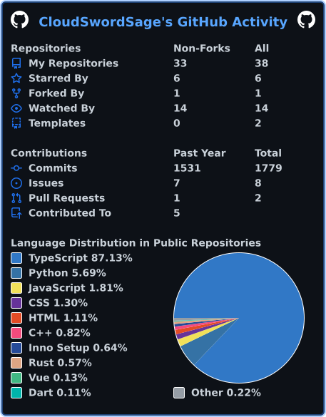

# 🌊 你好！我是墨烟行 | Hi there! I'm CloudSwordSage 🗡️

⚡ **A passionate developer exploring the realms of code**  
🌌 *Turning coffee into code, one commit at a time*

⚡ **执代码为剑，探数字疆界的开发者**  
🌌 *以咖啡为墨，写字节人生，每次提交皆是修行*

---

## 🛠️ 技术栈 | Tech Arsenal

<div align="center" style="margin: 20px 0;">
  
</div>

---

## 📚 当前修炼 | Learning Trail

<div align="center" style="margin: 20px 0;">
  
  
  
  
</div>

---

## 📮 联系通道 | Connect With Me

<div align="center">
  
[](mailto:cloudswordsage@qq.com)
[](mailto:zlf100518@163.com)
[](mailto:zlf100518@gmail.com)

</div>

---

## 📊 数据统计 | Analytics

<div align="center">

### 🌌 访问轨迹 | Footprints

[](https://github.com/CloudSwordSage)

[](https://github.com/cicirello/user-statistician)

### ⚡ 代码活力 | Activity

[](https://github.com/CloudSwordSage)

</div>

---

## ⏳ 编程报告 | WakaTime

<!--START_SECTION:waka-->


**🐱 我的 GitHub 数据** 

> 📦  使用了 2.0 MB GitHub 存储空间 
 > 
> 🏆 946 个贡献，在 2026 年
 > 
> 💼 开放招聘
 > 
> 📜 37 个公共仓库 
 > 
> 🔑 0 个私人仓库 
 > 
**我是夜猫 🦉** 

```text
🌞 早晨                     303 commits         █████░░░░░░░░░░░░░░░░░░░░   19.30 % 
🌆 白天                     457 commits         ███████░░░░░░░░░░░░░░░░░░   29.11 % 
🌃 傍晚                     433 commits         ███████░░░░░░░░░░░░░░░░░░   27.58 % 
🌙 晚上                     377 commits         ██████░░░░░░░░░░░░░░░░░░░   24.01 % 
```
📅 **星期六 时的我最有干劲** 

```text
星期一                      223 commits         ████░░░░░░░░░░░░░░░░░░░░░   14.20 % 
星期二                      229 commits         ████░░░░░░░░░░░░░░░░░░░░░   14.59 % 
星期三                      196 commits         ███░░░░░░░░░░░░░░░░░░░░░░   12.48 % 
星期四                      183 commits         ███░░░░░░░░░░░░░░░░░░░░░░   11.66 % 
星期五                      199 commits         ███░░░░░░░░░░░░░░░░░░░░░░   12.68 % 
星期六                      325 commits         █████░░░░░░░░░░░░░░░░░░░░   20.70 % 
星期日                      215 commits         ███░░░░░░░░░░░░░░░░░░░░░░   13.69 % 
```


📊 **本周消耗时间** 

```text
🕑︎ 时区: Asia/Shanghai

💬 编程语言: 
PowerShell               5 hrs 5 mins        ██████████░░░░░░░░░░░░░░░   39.63 % 
C++                      2 hrs 38 mins       █████░░░░░░░░░░░░░░░░░░░░   20.53 % 
JSON                     2 hrs 5 mins        ████░░░░░░░░░░░░░░░░░░░░░   16.36 % 
Markdown                 1 hr 35 mins        ███░░░░░░░░░░░░░░░░░░░░░░   12.40 % 
TOML                     25 mins             █░░░░░░░░░░░░░░░░░░░░░░░░   03.33 % 

🔥 编辑器: 
Trae                     12 hrs 34 mins      ████████████████████████░   97.99 % 
VS Code                  9 mins              ░░░░░░░░░░░░░░░░░░░░░░░░░   01.18 % 
Codex CLI                6 mins              ░░░░░░░░░░░░░░░░░░░░░░░░░   00.83 % 

🐱‍💻 项目: 
CPP                      7 hrs 2 mins        ██████████████░░░░░░░░░░░   54.85 % 
elevate-shell            2 hrs 27 mins       █████░░░░░░░░░░░░░░░░░░░░   19.14 % 
haidian                  1 hr 13 mins        ██░░░░░░░░░░░░░░░░░░░░░░░   09.51 % 
Unknown Project          49 mins             ██░░░░░░░░░░░░░░░░░░░░░░░   06.44 % 
hooks                    32 mins             █░░░░░░░░░░░░░░░░░░░░░░░░   04.28 % 

💻 操作系统: 
Windows                  12 hrs 49 mins      █████████████████████████   100.00 % 
```

🤖 **AI Coding This Week** 

```text
⏱ AI Coding Time: 3 hrs 39 mins (28.52%)

✍️ 167 lines written by AI, 2,518 lines written by hand (6.22% AI-written)

🔤 76,664,839 Input Tokens, 363,628 Output Tokens

💵 $75.09 Estimated AI Cost This Week

🧠 25 AI Sessions, 73 AI Prompts

GPT                      190 lines           █████████████████████████   100.00 % 
Deepseek                 0 lines             ░░░░░░░░░░░░░░░░░░░░░░░░░   00.00 % 

🔎 AI Coding Insights:
🧑‍💻 Mostly Hands-On — 6.22% of written lines came from AI
📚 Verbose Prompter — average 10,751 characters per prompt
🔁 Iterative Prompter — average 3 prompts per session
🔍 Hands-On Reviewer — 96.76% of changed lines were hand-edited
```

**我最常使用 Python** 

```text
Python                   12 repos            ███████████░░░░░░░░░░░░░░   42.86 % 
C++                      5 repos             ████░░░░░░░░░░░░░░░░░░░░░   17.86 % 
TypeScript               3 repos             ███░░░░░░░░░░░░░░░░░░░░░░   10.71 % 
Vue                      3 repos             ███░░░░░░░░░░░░░░░░░░░░░░   10.71 % 
JavaScript               2 repos             ██░░░░░░░░░░░░░░░░░░░░░░░   07.14 % 
```


**时间线**


 Last Updated on 10/08/2026 18:46:33 UTC
<!--END_SECTION:waka-->

---

<div align="center">
  
</div>

✨ *"The best way to predict the future is to code it."* ✨  
✨ *"预知未来最好的方式，就是亲手编码它"* ✨
