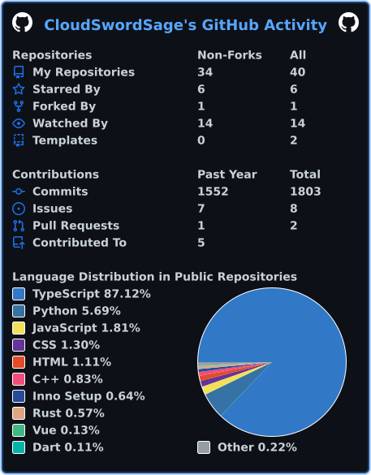

# 🌊 你好！我是墨烟行 | Hi there! I'm CloudSwordSage 🗡️

⚡ **A passionate developer exploring the realms of code**  
🌌 *Turning coffee into code, one commit at a time*

⚡ **执代码为剑，探数字疆界的开发者**  
🌌 *以咖啡为墨，写字节人生，每次提交皆是修行*

---

## 🛠️ 技术栈 | Tech Arsenal

<div align="center" style="margin: 20px 0;">
  
</div>

---

## 📚 当前修炼 | Learning Trail

<div align="center" style="margin: 20px 0;">
  
  
  
  
</div>

---

## 📮 联系通道 | Connect With Me

<div align="center">
  
[](mailto:cloudswordsage@qq.com)
[](mailto:zlf100518@163.com)
[](mailto:swordsagecloud@gmail.com)

</div>

---

## 📊 数据统计 | Analytics

<div align="center">

### 🌌 访问轨迹 | Footprints

[](https://github.com/CloudSwordSage)

[](https://github.com/cicirello/user-statistician)

### ⚡ 代码活力 | Activity

[](https://github.com/CloudSwordSage)

</div>

---

## ⏳ 编程报告 | WakaTime

<!--START_SECTION:waka-->


**🐱 我的 GitHub 数据** 

> 📦  使用了 2.0 MB GitHub 存储空间 
 > 
> 🏆 1,263 个贡献，在 2026 年
 > 
> 💼 开放招聘
 > 
> 📜 39 个公共仓库 
 > 
> 🔑 0 个私人仓库 
 > 
**我是夜猫 🦉** 

```text
🌞 早晨                     451 commits         ██████░░░░░░░░░░░░░░░░░░░   22.85 % 
🌆 白天                     497 commits         ██████░░░░░░░░░░░░░░░░░░░   25.18 % 
🌃 傍晚                     542 commits         ███████░░░░░░░░░░░░░░░░░░   27.46 % 
🌙 晚上                     484 commits         ██████░░░░░░░░░░░░░░░░░░░   24.52 % 
```
📅 **星期六 时的我最有干劲** 

```text
星期一                      275 commits         ███░░░░░░░░░░░░░░░░░░░░░░   13.93 % 
星期二                      301 commits         ████░░░░░░░░░░░░░░░░░░░░░   15.25 % 
星期三                      251 commits         ███░░░░░░░░░░░░░░░░░░░░░░   12.72 % 
星期四                      232 commits         ███░░░░░░░░░░░░░░░░░░░░░░   11.75 % 
星期五                      233 commits         ███░░░░░░░░░░░░░░░░░░░░░░   11.80 % 
星期六                      424 commits         █████░░░░░░░░░░░░░░░░░░░░   21.48 % 
星期日                      258 commits         ███░░░░░░░░░░░░░░░░░░░░░░   13.07 % 
```


📊 **本周消耗时间** 

```text
🕑︎ 时区: Asia/Shanghai

💬 编程语言: 
Markdown                 4 hrs 14 mins       ████████░░░░░░░░░░░░░░░░░   31.43 % 
TypeScript               3 hrs 21 mins       ██████░░░░░░░░░░░░░░░░░░░   24.86 % 
C++                      3 hrs 14 mins       ██████░░░░░░░░░░░░░░░░░░░   23.97 % 
Python                   1 hr 27 mins        ███░░░░░░░░░░░░░░░░░░░░░░   10.75 % 
JavaScript               38 mins             █░░░░░░░░░░░░░░░░░░░░░░░░   04.76 % 

🔥 编辑器: 
VS Code                  10 hrs 53 mins      ████████████████████░░░░░   80.75 % 
Opencode Cli             2 hrs 35 mins       █████░░░░░░░░░░░░░░░░░░░░   19.25 % 

🐱‍💻 项目: 
soler                    6 hrs 15 mins       ████████████░░░░░░░░░░░░░   46.39 % 
IME_pred                 3 hrs 44 mins       ███████░░░░░░░░░░░░░░░░░░   27.77 % 
Homework                 1 hr 56 mins        ████░░░░░░░░░░░░░░░░░░░░░   14.40 % 
DSA                      1 hr 24 mins        ███░░░░░░░░░░░░░░░░░░░░░░   10.46 % 
C++                      5 mins              ░░░░░░░░░░░░░░░░░░░░░░░░░   00.70 % 

💻 操作系统: 
Windows                  13 hrs 29 mins      █████████████████████████   100.00 % 
```

🤖 **AI Coding This Week** 

```text
⏱ AI Coding Time: 8 hrs 7 mins (60.28%)

✍️ 11,353 lines written by AI, 900 lines written by hand (92.65% AI-written)

🔤 3,994,545 Input Tokens, 1,075,178 Output Tokens

💵 $658.80 Estimated AI Cost This Week

🧠 23 AI Sessions, 50 AI Prompts

Opencode-Cli             9,390 lines         ████████████████████░░░░░   80.12 % 
GPT                      2,330 lines         █████░░░░░░░░░░░░░░░░░░░░   19.88 % 
Deepseek                 0 lines             ░░░░░░░░░░░░░░░░░░░░░░░░░   00.00 % 

🔎 AI Coding Insights:
🤖 AI-Driven — 92.65% of written lines came from AI
📄 Detailed Prompter — average 691 characters per prompt
🔁 Iterative Prompter — average 2 prompts per session
🚀 High AI Trust — 9.31% of changed lines were hand-edited
```

**我最常使用 Python** 

```text
Python                   14 repos            ███████████░░░░░░░░░░░░░░   45.16 % 
C++                      6 repos             █████░░░░░░░░░░░░░░░░░░░░   19.35 % 
TypeScript               3 repos             ██░░░░░░░░░░░░░░░░░░░░░░░   09.68 % 
Vue                      3 repos             ██░░░░░░░░░░░░░░░░░░░░░░░   09.68 % 
JavaScript               2 repos             ██░░░░░░░░░░░░░░░░░░░░░░░   06.45 % 
```


**时间线**


 Last Updated on 28/09/2026 02:57:58 UTC
<!--END_SECTION:waka-->

---

<div align="center">
  
</div>

✨ *"The best way to predict the future is to code it."* ✨  
✨ *"预知未来最好的方式，就是亲手编码它"* ✨
