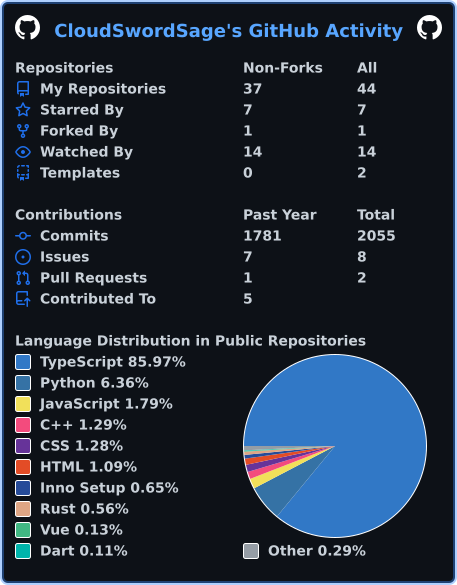
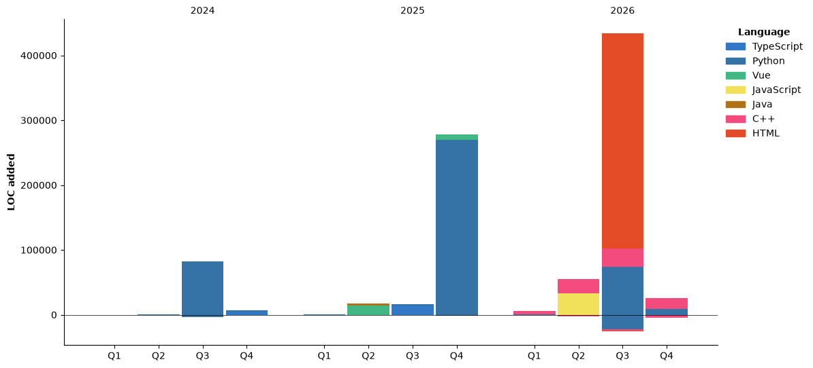

# 🌊 你好！我是墨烟行 | Hi there! I'm CloudSwordSage 🗡️

⚡ **A passionate developer exploring the realms of code**  
🌌 *Turning coffee into code, one commit at a time*

⚡ **执代码为剑，探数字疆界的开发者**  
🌌 *以咖啡为墨，写字节人生，每次提交皆是修行*

---

## 🛠️ 技术栈 | Tech Arsenal

<div align="center" style="margin: 20px 0;">
  
</div>

---

## 📚 当前修炼 | Learning Trail

<div align="center" style="margin: 20px 0;">
  
  
  
  
</div>

---

## 📮 联系通道 | Connect With Me

<div align="center">
  
[](mailto:cloudswordsage@qq.com)
[](mailto:zlf100518@163.com)
[](mailto:swordsagecloud@gmail.com)

</div>

---

## 📊 数据统计 | Analytics

<div align="center">

### 🌌 访问轨迹 | Footprints

[](https://github.com/CloudSwordSage)

[](https://github.com/cicirello/user-statistician)

### ⚡ 代码活力 | Activity

[](https://github.com/CloudSwordSage)

</div>

---

## ⏳ 编程报告 | WakaTime

<!--START_SECTION:waka-->


**🐱 我的 GitHub 数据** 

> 📦  使用了 2.0 MB GitHub 存储空间 
 > 
> 🏆 1,461 个贡献，在 2026 年
 > 
> 💼 开放招聘
 > 
> 📜 44 个公共仓库 
 > 
> 🔑 0 个私人仓库 
 > 
**我是夜猫 🦉** 

```text
🌞 早晨                     504 commits         █████░░░░░░░░░░░░░░░░░░░░   21.85 % 
🌆 白天                     537 commits         ██████░░░░░░░░░░░░░░░░░░░   23.28 % 
🌃 傍晚                     653 commits         ███████░░░░░░░░░░░░░░░░░░   28.31 % 
🌙 晚上                     613 commits         ███████░░░░░░░░░░░░░░░░░░   26.57 % 
```
📅 **星期六 时的我最有干劲** 

```text
星期一                      327 commits         ████░░░░░░░░░░░░░░░░░░░░░   14.17 % 
星期二                      410 commits         ████░░░░░░░░░░░░░░░░░░░░░   17.77 % 
星期三                      279 commits         ███░░░░░░░░░░░░░░░░░░░░░░   12.09 % 
星期四                      285 commits         ███░░░░░░░░░░░░░░░░░░░░░░   12.35 % 
星期五                      269 commits         ███░░░░░░░░░░░░░░░░░░░░░░   11.66 % 
星期六                      462 commits         █████░░░░░░░░░░░░░░░░░░░░   20.03 % 
星期日                      275 commits         ███░░░░░░░░░░░░░░░░░░░░░░   11.92 % 
```


📊 **本周消耗时间** 

```text
🕑︎ 时区: Asia/Shanghai

💬 编程语言: 
Python                   6 hrs 16 mins       ██████████░░░░░░░░░░░░░░░   39.54 % 
C++                      2 hrs 49 mins       ████░░░░░░░░░░░░░░░░░░░░░   17.83 % 
Markdown                 2 hrs 33 mins       ████░░░░░░░░░░░░░░░░░░░░░   16.17 % 
Other                    51 mins             █░░░░░░░░░░░░░░░░░░░░░░░░   05.40 % 
PowerShell               35 mins             █░░░░░░░░░░░░░░░░░░░░░░░░   03.72 % 

🔥 编辑器: 
VS Code                  10 hrs 3 mins       ████████████████░░░░░░░░░   63.47 % 
Opencode Cli             4 hrs 43 mins       ███████░░░░░░░░░░░░░░░░░░   29.84 % 
OpenCode                 1 hr 3 mins         ██░░░░░░░░░░░░░░░░░░░░░░░   06.69 % 

🐱‍💻 项目: 
Bot                      4 hrs 8 mins        ███████░░░░░░░░░░░░░░░░░░   26.16 % 
VoxFence                 3 hrs 45 mins       ██████░░░░░░░░░░░░░░░░░░░   23.75 % 
yasb                     1 hr 57 mins        ███░░░░░░░░░░░░░░░░░░░░░░   12.36 % 
AE2-Lightning-Tech-Reborn1 hr 23 mins        ██░░░░░░░░░░░░░░░░░░░░░░░   08.76 % 
test                     1 hr 6 mins         ██░░░░░░░░░░░░░░░░░░░░░░░   07.04 % 

💻 操作系统: 
Windows                  15 hrs 51 mins      █████████████████████████   100.00 % 
```

🤖 **AI Coding This Week** 

```text
⏱ AI Coding Time: 12 hrs 18 mins (77.63%)

✍️ 25,370 lines written by AI, 4,717 lines written by hand (84.32% AI-written)

🔤 3,355,887 Input Tokens, 1,148,003 Output Tokens

💵 $1216.23 Estimated AI Cost This Week

🧠 11 AI Sessions, 77 AI Prompts

DeepSeek                 25,555 lines        █████████████████████████   100.00 % 
GPT                      0 lines             ░░░░░░░░░░░░░░░░░░░░░░░░░   00.00 % 

🔎 AI Coding Insights:
🤖 AI-Driven — 84.32% of written lines came from AI
📚 Verbose Prompter — average 3,769 characters per prompt
🔁 Iterative Prompter — average 7 prompts per session
🚀 High AI Trust — 27.94% of changed lines were hand-edited
```

**我最常使用 Python** 

```text
Python                   14 repos            ███████████░░░░░░░░░░░░░░   42.42 % 
C++                      7 repos             █████░░░░░░░░░░░░░░░░░░░░   21.21 % 
TypeScript               3 repos             ██░░░░░░░░░░░░░░░░░░░░░░░   09.09 % 
JavaScript               2 repos             ██░░░░░░░░░░░░░░░░░░░░░░░   06.06 % 
TeX                      1 repo              █░░░░░░░░░░░░░░░░░░░░░░░░   03.03 % 
```


**时间线**




 Last Updated on 01/11/2026 03:43:40 UTC
<!--END_SECTION:waka-->

---

<div align="center">
  
</div>

✨ *"The best way to predict the future is to code it."* ✨  
✨ *"预知未来最好的方式，就是亲手编码它"* ✨
